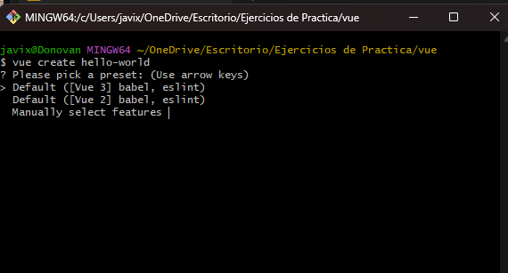
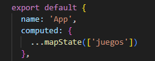
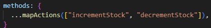
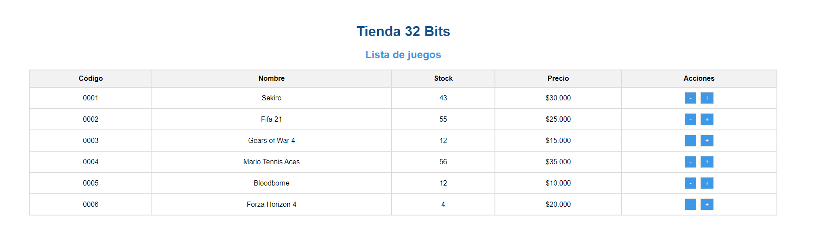

- [Desafío Vuex (Tienda 32 Bits)](#desafío-vuex-tienda-32-bits)
  - [Requerimientos](#requerimientos)
  - [Pasos](#pasos)
  - [Resultado](#resultado)

# Desafío Vuex (Tienda 32 Bits)

- Descripción

La tienda de juegos de video 32bits te ha encargado desarrollar un prototipo para su nuevo
sistema de gestión de productos. Para esto, se le ha solicitado el desarrollo de una aplicación
SPA utilizando VueJS mediante la creación del proyecto con Vue-Cli, además la incorporación
Vuex para controlar todos los datos de forma centralizada.

  ---

## Requerimientos

1. Crear un proyecto con Vue CLI que incluya Babel y Vuex únicamente en sus configuraciones.

2. Alojar el JSON de juegos en el estado global de la aplicación.

3. Utilizar mapState para el consumo de los juegos en el componente App.

4. Utilizar acciones para modificar el stock de los videojuegos.

   ---

## Pasos

1. Se crea una aplicación Vue en la consola A través del siguiente Comando "__*vue create --default mi-ejemplo*__"

2. Seleccionamos la opcion manual y marcamos las opciones que necesitemos en este caso (vuex y router) 

3. Alojamos el json de juegos en la carpeta store

4. Utilizar mapState para el consumo de los juegos en el componente App

5. Utilizar acciones para modificar el stock de los videojuegos

---

## Resultado

